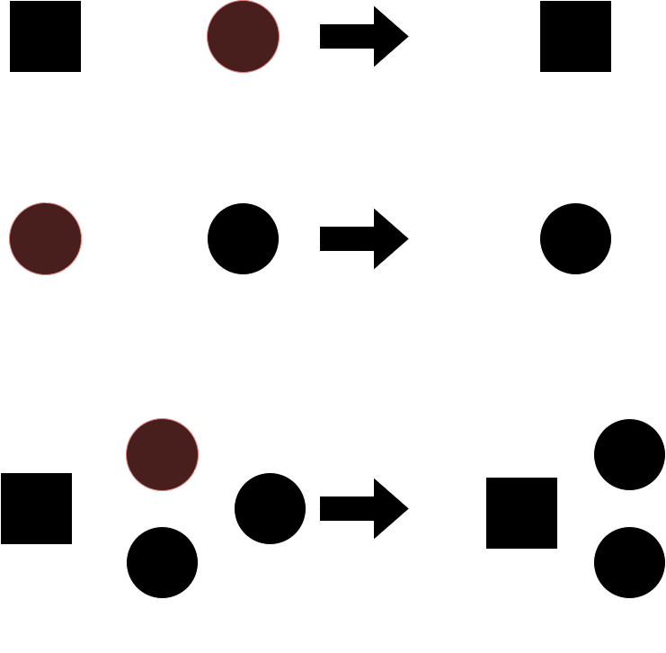

# Mushrobotics Network Protocol

Below is a description of the protocol I will be implementing for the mushroom robotics project.  I'm also going to be using this document as a place to attempt to organize my thoughts around the protocol so it likely won't be super readable or understandable for the near future.  I hope to fix this once the protocol actually exists, but in the meantime I think this is probably how it will be.

## Description

The idea for the use case of this project should follow the below diagram:

The important thing to highlight from this document is that I'm expecting the router to pretty much be consistent.  I'm pretty convinced that this shouldn't be a problem because the raspberry pi zero running the router won't be handling a ton of traffic, however it may benefit me to add a second router but for now I will ignore this possible problem and assume there is one base station.

I would like to use the nRF24L01+ radio, which can receive on 6 pipes.  To make things easier, each node can also keep track of 2 extra node addresses to allow nodes to have 8 children making their children representable by 3 bits (or in octal mathematically).  Personally, I simply like this being a nice octal number, however 3 does not divide 1 Byte so I may come to regret this decision down the road.

Ideally, this would mean that a representation of the network wouldn't actually be a network, but instead a tree as below:

However, this tree structure is not redundancy proof.  In fact, if any node dies, all of its children will die which will certainly be a problem given my SEDs should be battery powered.  Therefore, I (in all of my finite wisdom) have decided to use what I will call a dual tree (shown below):

In my mind, this offers about as good as one can get in terms of both tree-like structure and a bit of redundancy.  It is also important to note, that I don't think it is particularly necessary for two nodes to have the same set of children.  It probably makes more sense for each of the either nodes to share some number of children (at least 1) to allow a bit better random redundancy but it is much harder to draw that as a picture.

I expect my router to be caching the states and addresses of each of it's children so it makes sense to abstract this storage into a n-tier storage system.  Basically, the idea is that the router can expect 8 element arrays of Nodes that contain a pointer to another block of 8 as shown below:

'

Ideally, this should allow me to specify addresses in terms of parent, child, grandchild, ...  Specifically, I would like to be able to say 1.2.3.4, where 1 is the parent of 2 which is the parent of 3 which is the parent of 4.  However, this can get a bit tricky because my dual-tree network shape means each node will have 2 addresses.  An incredibly simple example of this is shown below:

In this example, the right-most node can be labeled 1.1.1, 1.3.1, 2.1.1, and 2.3.1.  This ambiguity is definitely a bit difficult so I will be attempting to come up with a solution in the near future.

I think I can solve the ambiguity problem by giving each device a router assigned ID (kind of like a MAC address except its assigned).  With this, I can associate the ip's as part of the Node part in a vector of u8s.  Specifically, I can make the first 4 bits the first possible address set and the second 4 bits the second possible address.  This makes storing the addresses 2*n storage instead of 2^n which is important (although the depth of the tree is unlikely to grow significantly).  This means that Node addresses can be expressed as below (which I'm still working on a formula for):

With this model, leaves further down the tree have significantly higher redundancy, which isn't necessarily a bad thing.  I don't, however, think I have the capitol or reason to make more than 40 robotic mushroom farmers in my apartment so I'm pretty sure I won't have any more than 2 redundancies which is much easier to deal with.  In the future, I would probably recommend just utilizing thread for an actual greenhouse / production situation because it doesn't blow up in redundancy with the addition of new nodes.  But, if massive amounts of redundancy are necessary I guess my solution would work brilliantly for large numbers of connected devices.

Now that the address mapping is complete, the next step is to define the addition and removal of nodes to the network.  For the first 8 mushroom farming robots (which I will call the root nodes), the pairing process is incredibly simple. These robots will form the first pair of 8 robots.  I think this makes sense because realistically speaking there is no need to add any complexity yet and the death / power-off of these robots doesn't need to be complex in the beginning.  Then comes the addition of first children nodes (i.e. the 1st wave).  I think realistically it makes sense to stagger their entrance to keep a balanced tree.  Basically, this just means that each root node will fill their 1st wave robots in parallel.  Overall, my goal with additions and deletions is to try to keep a balanced tree so I can minimize the network depth and, therefore, the storage and complexity requirements.

The diagram below illustrates a few different node addition cases and how the network should react to them:

Next comes the more complicated part of the problem.  Removing nodes.  Removing nodes can be both intentional and unintentional.  For an intentional node removal, a robot may need maintenance, in which case there should be some button or built-in alert on the robot to alert the network to a network rewire.  A common unintentional node removal would be a robot dying or being destroyed in an accident.  In the robot dying example, it may be necessary to add a low-battery alert signal into the robots so the network can move them to the leaves (making removal easier).  However, in an accident there is no real way to predict the death of a robot so a network rework will be definitely necessary.

The main cases for removal is the removal of a leaf node.  This is the easiest case and the node should wait until its parent is receiving and tell them that they are going to die. In which case they can be powered off.  In the case of an unintentional removal of a leaf node, the parent should use maximum retries to reach the node.  After the last retry, if the leaf has not responded, the parent should propagate the node's death to the router through its parent(s). If, instead, a node with children is to be removed, the situation is a bit more complex.  If a node is receiving an intentional power-off, the node should promote one of it's children to its situation (making its way towards the leaf).  Once it becomes a leaf, the node should propagate a signal to the router that it is going offline.  If a parent node is removed unintentionally, then it's parents should realize it has become unresponsive and should ask the router for a promotion(s) which they will perform with a child node.  A visual of these removal cases is shown below:

The above cases are more-or-less the best case scenarios for the nodes.  The worst case scenario is a clump of robots unintentionally being removed at once.  This brings the final removal case, or removal of two parents.  If both parents of a node are removed, the network does have the ability to repair itself (namely because the router has pretty much perfect information).  First, the parents of the dead nodes (or the router if it is a root node) will send to the router the dead nodes.  Now, the router must figure out what to do with the children of the dead node.  To do this, the router can assign a node from each level as the new parent (i.e. promote a node) until the tree form is restored.  This is illustrated below:

Now that the removal cases are documented, it is necessary to revisit the addition of a new node.  When a node is removed, the format of the complete balanced dual tree is altered.  This is ok, however the router should record the locations of removed nodes and make certain that the next addition fills in the location of a previously removed node to help to maintain a complete balanced dual tree.

**Note**: In the examples above of nodes switching places.  The node taking the place of the parent effectively takes their identity and now has that nodes device ID.  This is propagated back to the router, so the node status metadata can be updated accordingly.

Although the above discussion is all fine and dandy it is probably necessary for me to actually make real protocol decisions now.  Mainly I should probably specify packet-related stuff and do some pairing process stuff (you-know the fun stuff).  While I'm writing out this, it is necessary for me to keep in mind that I would like to use the nRF24L01+ as my radio transmitter and receiver (hey, its cheap and I'm broke).  Below is a picture of the enhanced-shockburst packet format, but really the most important part of the packet is the fact that the payload is 32 Bytes.

A few important things about every good packet is a to address, a from address, and data.  Normally, creating a to and from address is super simple because internet addresses are usually fixed length. Unfortunately, however, I chose the dual tree so I can't exactly do this.  However, it is possible to use 4-bit numbers as a sort of variable length packet. First, all addresses will be addressed in the form x.y.z. where x, y, and z belong to [1, 9] (1-9 are chosen because it means 0 can be used to delineate between addresses). Then a packet will contain the from address, the 0 delineator, and the to address.  For example, a packet moving from 1.2.3 to 9.8.7 would be 0b0001_0010_0011_0000_1001_1000_0111 (1.2.3 (0b0001_0010_0011), delimiter (0b0000), and 9.8.7 (0b1001_1000_0111)).  It is also going to be necessary to stream large packets (i.e.e greater than 32 Bytes) over the network.  Therefore, following the address, there needs to be a payload length.  With a singular u8 as the payload length, the maximum payload length would be 255 bytes, which doesn't seem to be enough for an image.  I think that, reasonably, a u16 as the payload length will work fine for a singular transmission as 65.535 kB is likely to be much larger than the maximum piece of data I'll send in this environment.  Therefore, the two bytes following the address length will denote the payload length.  Then, the next n packets corresponding to the packet can be sent without an address and size.

However, most of the communication in the network is likely to be parent to child so adding all of the address bits is quiet redundant.  I think to fix this we can use another postfix to denote that the packet is directly from the parent.  For this postfix I will choose 9 or 0b1001.  Therefore, if parent is sending a message to its child it can use a 1 byte address.  If I am going to give the parents the power of a new postfix, I might as well do the same for a child.  For the child, I will choose 0xA or 0b1010 which can be used by a child to directly address its parent without needing the whole address.

In the nRF24L01 documentation, it mentions that addresses with with only one toggle (i.e. 0x0F) are advised against.  Also preamble continuations are advised against (i.e. 0b101010 or 0b010101).  There are two possible preamble continuations (0b10... and 0b01...), 39 one toggle situations and 2 all 1s or 0s situations.  This leaves a total of 2^40 - 43 possible addresses.  For the general format of these addresses please see Forbidden Addresses.

To save a bit of trouble, it also will be useful to reserve at least one address for use by the router and possibly a second address just in case (probably for pairing).  The saved addresses will be [0x4E, 0x61, 0x74, 0x65, 0x21] and [0x21, 0x65, 074, 0x61, 0x4E] for no reason other than I like the addresses.

The address assignment algorithm I'm going to use is incredibly simple.  Basically, the base station is 0x4E61746521 (which is a bit of an anomaly), then for each following robot added to the network, their address will be their node number subtracted from the max address 0xFFFFFFFFFF.  For example, robot 10 would be 0xFFFFFFFFFF - 0xA.  However, this means that some addresses may overlap with forbidden addresses.  In this case, I will keep track of the number of skipped addresses and assign the robot to the next available address. The main benefit of this assignment algorithm is it keeps everything incredibly simple and neighboring nodes share adjacent addresses which (almost always), means that the node will be on the same network mask, allowing for me to utilize additional enhanced shockburst functionalities.

## Directory Layout

The mushrobotics protocol project and implementation is layed out as the base protocol in protocol/mushrobotics-protocol directory with macros in the protocol/mushrobotics-protocol-derive directory.

## Reserved Addresses

* [0x4E, 0x61, 0x74, 0x65, 0x21] - Base Station Receive Address
* [0x21, 0x65, 0x74, 0x61, 0x4E] - Pairing Address

## Forbidden Addresses

* [0x00, 0x00, 0x00, 0x00 ,0x00]
* [0x00, 0x00, 0x00, 0x00, 0x01]
* [0x00, 0x00, 0x00, 0x00, 0x03]
* ...
* [0x7F, 0x7F, 0x7F, 0x7F, 0x7F]
* [0xFF, 0xFF, 0xFF, 0xFF, 0xFF]
* [0xAA, 0xAA, 0xAA, 0xAA, 0xAA]
* [0x55, 0x55, 0x55, 0x55, 0x55]

## Inspirations

* [OpenThread](https://openthread.io/)

#### Last Updated: January 31, 2024